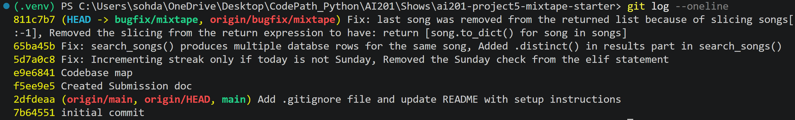

# ai201-project5-mixtape-starter - submission.md

Screenshot of git log --oneline:

---

## AI Usage

- *How you used AI tools during codebase navigation and debugging:* 
- *What they helped you understand:* 
- *Where you verified or overrode their output:* 

---

## Codebase Map

**Main files & What each one does:**

- app.py: Creates the Flask app, configures SQLAlchemy, registers all route blueprints, and creates database tables.
- models.py: Defines the database schema and model relationships for users, songs, tags, listening events, ratings, playlists, playlist entries, friendships, and notifications.
- routes/songs.py: Handles song search, song detail lookup, song rating, and recording when a user listens to a song.
- routes/playlists.py: Handles playlist creation, playlist detail lookup, retrieving playlist songs, and adding songs to playlists.
- routes/users.py: Handles user profile lookup, listening streak lookup, notification retrieval, and marking notifications as read.
- routes/feed.py: Handles feed endpoints for "Friends Listening Now" and general friend activity.
- services/search_service.py: Contains song search logic and single-song lookup logic.
- services/streak_service.py: Records listening events and updates user listening streaks.
- services/feed_service.py: Builds feed responses from friends' ListeningEvent records.
- services/playlist_service.py: Creates playlists and retrieves playlist metadata or ordered playlist songs.
- services/notification_service.py: Creates notifications, handles playlist-add notification behavior, saves song ratings, retrieves notifications, and marks notifications as read.
- seed_data.py: Populates the database with sample users, friendships, songs, tags, playlists, ratings, listening events, and notifications.
- tests/: Contains pytest tests for streak, search, and playlist behavior.

**Data flow example: adding a song to a playlist triggers a notification**

1. A client sends POST /playlists/<playlist_id>/songs with song_id and added_by.
2. routes/playlists.py runs the add_song(playlist_id) route.
3. The route validates that song_id and added_by were provided.
4. The route calls add_to_playlist(playlist_id, song_id, added_by) from services/notification_service.py.
5. add_to_playlist() looks up the Song, the user who added it, and the Playlist.
6. If the song is not already in the playlist, it appends the song to playlist.songs and commits the database change.
7. If the person adding the song is not the original sharer, add_to_playlist() calls create_notification().
8. create_notification() creates a Notification row for the original song sharer and commits it.
9. Later, when the user visits GET /users/<user_id>/notifications, routes/users.py calls get_notifications() from services/notification_service.py.
10. get_notifications() queries the user's notifications, orders them newest first, converts them to dictionaries, and returns them to the route.

**Organization Patterns:**

- Routes are thin controller layers. They read request data, validate required fields, call service functions, and turn results or errors into JSON responses.
- Services contain most of the app logic. They query models, enforce feature rules, update records, and commit database changes.
- Models define both tables and serialization through to_dict() methods.
- Errors are usually raised as ValueError in the service layer and caught in the route layer.
- The app is organized by feature area: songs, playlists, users, feed, search, streaks, and notifications.
- Database access is done through the shared db object from app.py.
- Many features are connected through shared models. For example, ListeningEvent powers the feed and streaks, while Song, Playlist, and Notification connect playlist activity to user notifications.

---

## Root Cause Analysis

<!---
For each of the 3+ bugs you fix, write an entry in your submission doc with all five of these fields:

1. Issue number and title
2. How you reproduced it — What steps did you take to confirm the bug exists before touching any code? What inputs, sequence of actions, or data condition triggered the behavior?
3. How you found the root cause — Which files did you look at? What was your navigation path? What moment made you confident you'd found the right place — not just a suspicious area, but the specific cause?
4. The root cause — In plain English, explain exactly what was wrong. Not "there was a bug in the streak logic" — explain the specific condition, comparison, or missing step that caused the problem.
5. Your fix and side-effect check — What did you change and why does that change fix the root cause? What related functionality did you check afterward to confirm you didn't break anything?--->

| Issue Number & Title | How you reproduced it | How you found the root cause | The Root Cause | Your Fix & Side-Effect Check |
|----------------------|-----------------------|------------------------------|-----------------|-------------------------------|
| 1. My listening streak keeps resetting | I ran the pytests of tests/test_streaks.py targeting the streak logic. This test sets up a mock user and simulates consecutive listening events across a weekend boundary: first on Saturday, June 15, 2024 (weekday() == 5), and next on Sunday, June 16, 2024 (weekday() == 6). The expected behavior is that the user's listening_streak increments to 2, but the test fails with an AssertionError: assert 1 == 2, proving that the streak incorrectly resets back to 1 on Sunday. | I looked at the services/streak_services.py and added temporary print statements in the conditional statements in update_listening_streak function. When I ran the pytests again with these print statements, I found the logs revealed that on Sunday (weekday() == 6), the code skipped the expected increment logic and fell into a block designed to reset or incorrectly handle the week boundary, which made me 100% confident I had found the exact root cause here, a flawed day-of-week boundary comparison. | At line 73 in services/streak_service.py, it had the elif statement: `elif days_since_last == 1 and today.weekday() != 6:`. This showed that it increments the streak only if yesterday was the last listened day and today is not Sunday. The last test in tests/test_streaks.py failed because Saturday to Sunday should count as consecutive, but the code reset the streak instead. | I removed `and today.weekday() != 6` from the elif statement. This change fixed the root cause because it follows the streak rule that is based on consecutive calendar days, not weekdays only. Any listen exactly one day after the previous listen increments the streak. I ran the streak pytests again and it showed that all related streak behavior tests passed. |
| 3. The same song keeps showing up twice in search | I ran the tests/test_search.py and got all 5 tests passed. However, there was a bug in 3rd test, so I confirmed that this test creates a song called "Crown Heights Anthem", and this song is assigned three tags (rap, hip-hop, boom bap). The bug behavior is that same song can appear multiple times. | I modified the 3rd test in tests/test_search.py by adding raw_rows and temporary print statements. After that I ran the pytests again, and I saw "Crown Heights Anthem" 3 times. I looked at services/search_service.py and found the bug in search_songs() function that uses an outerjoin with the song_tags table. | search_songs() joined Song with the song_tags association table. Since a song can have multiple tags, the join can produce multiple database rows for the same song. For example, if one song has three tags, the join can return that song three times at the SQL row level. | I added .distinct() in between .filter() and .all() in the results part of the search_songs(). This change fixes the root cause because it tells the database only return unique Song rows and if the same song appears multiple times because of the different tag join, it has to collapse it down to one result. It confirmed that only one result of "Crown Heights Anthem" shown on the output after adding .distinct() in raw_rows and running the pytests of tests/test_search.py. |
| 5. The last song in a playlist never shows up | I ran the tests/test_playlists.py and failed the first two tests. Both tests have the same bug in get_playlist_songs() function, which removes the last song from the returned list. | I looked at services/playlist_service.py and added a print statement before returning anything in get_playlist_songs() function. When I ran the tests/test_playlists.py, the expected behavior is to see all 5 songs or all 5 tracks (`"Track 1", "Track 2", "Track 3", "Track 4", "Track 5"`), but the bug behavior showed only 4 songs and no "Track 5" printed on the output. | The bug was the slice `songs[:-1]` in the return expression. In Python, songs[:-1] means a copy of the list from the start up to, but not including the last element, so it discarded the final song every time. The fix was to remove the slicing from the return expression to include the last song in the list. | I removed slicing and made the return expression to `[song.to_dict() for song in songs]`. This change fixes the root cause because iterating over songs directly includes all elements, so the returned list now contains one dict per song in the playlist. I confirmed this change by running the pytests of tests/test_playlists.py and all 3 tests passed, showing all 5 songs or all 5 tracks (`"Track 1", "Track 2", "Track 3", "Track 4", "Track 5"`) in the list for the first two tests. |
